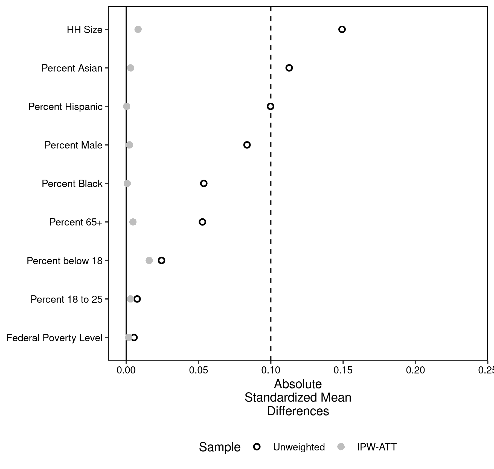
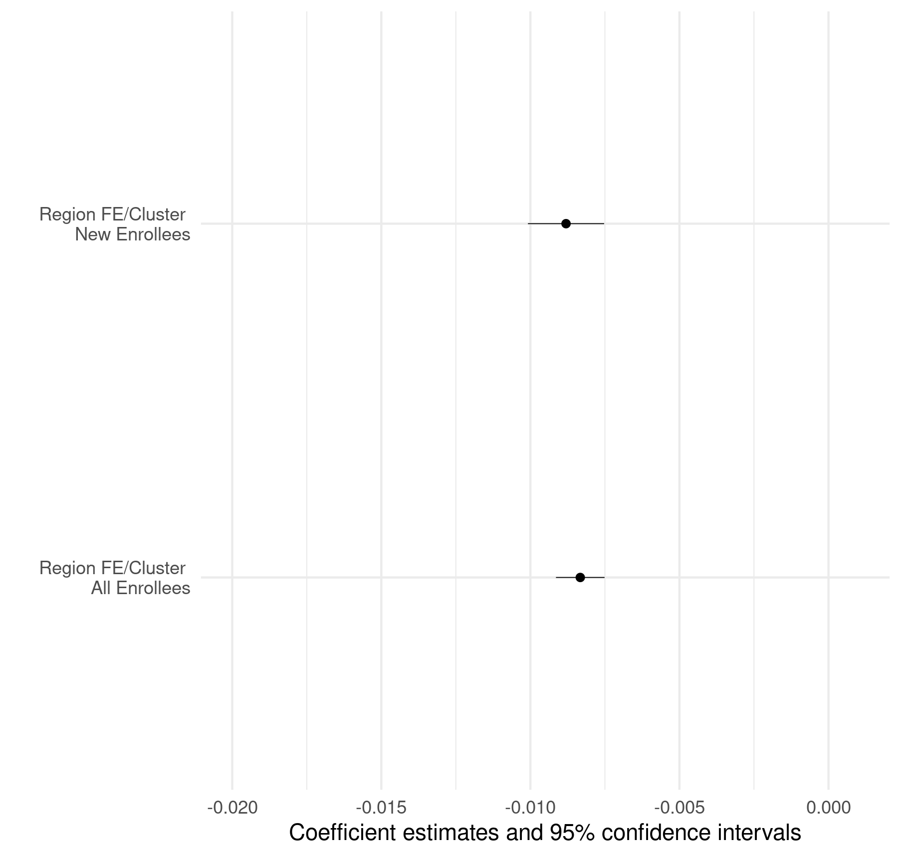
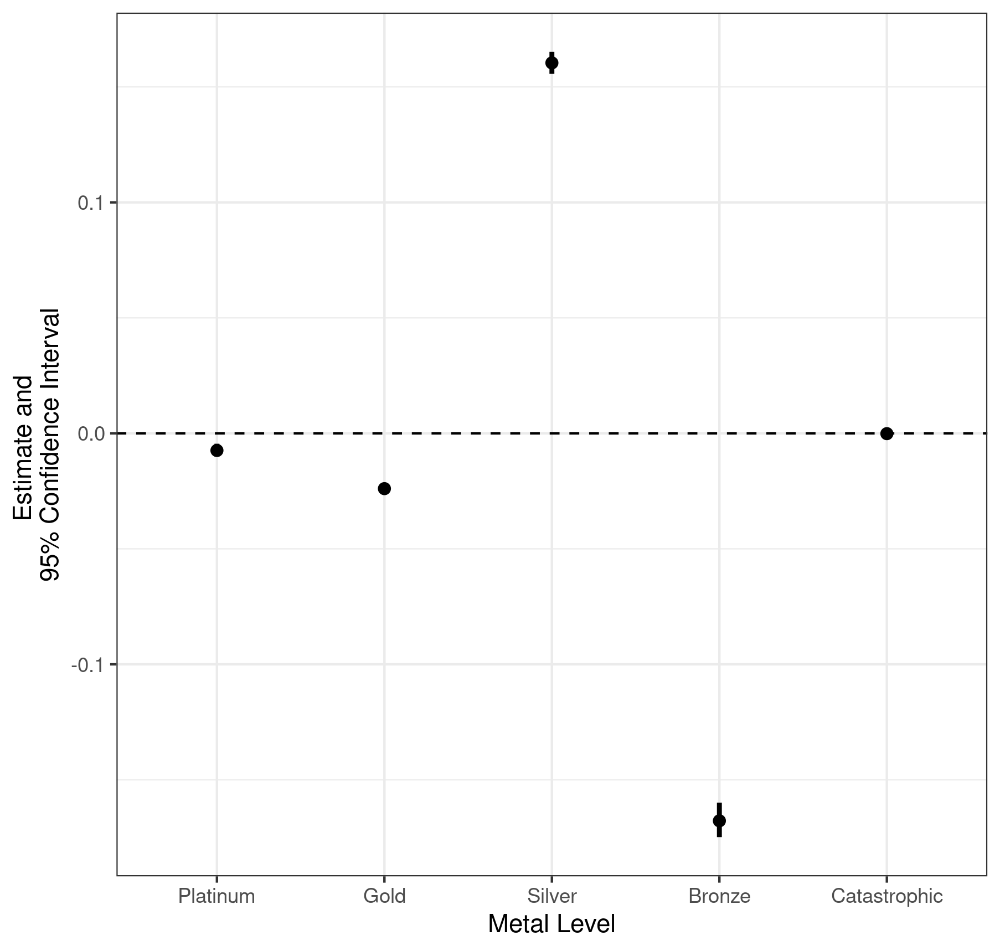
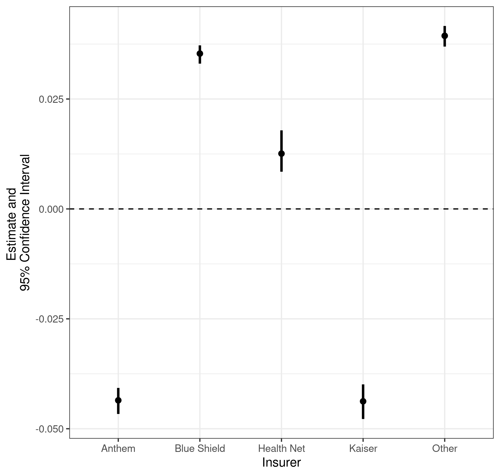

<!-- Adjust some CSS code for font size, maintain R code font size -->
<style type="text/css">
.remark-slide-content {
    font-size: 30px;
    padding: 1em 2em 1em 2em;    
}
.remark-code, .remark-inline-code { 
    font-size: 20px;
}
</style>


<!-- Set R options for how code chunks are displayed and load packages -->
```{r setup, include=FALSE}
options(htmltools.dir.version = FALSE)
options(dplyr.summarise.inform = FALSE)
library(knitr)
opts_chunk$set(
  fig.align="center",  
  fig.height=3, #fig.width=6,
  # out.width="748px", #out.length="520.75px",
  dpi=300, #fig.path='Figs/',
  cache=T#, echo=F, warning=F, message=F
  )

knitr::opts_hooks$set(fig.callout = function(options) {
  if(options$fig.callout) {
    options$echo = FALSE
  }
  options
})

if (!require("pacman")) install.packages("pacman")
pacman::p_load(tidyverse, ggplot2, dplyr, lubridate, readr, readxl, hrbrthemes,
               scales, gganimate, gapminder, gifski, png, tufte, plotly, OECD,
               ggrepel, xaringanExtra)
```


```{r xaringan-scribble, echo=FALSE}
xaringanExtra::use_scribble(rgb(0.9, 0.5, 0.5))
```

# Some decisions are hard

.center[
<iframe width="800" height="500" src="https://www.youtube.com/embed/oWXNf3JVWpI?start=146&end=272" frameborder="0" allowfullscreen></iframe>
]

---
# In the health insurance setting...

1. Insurance choice is confusing, particularly on the ACA exchanges

2. Size of the market introduces decision problems on a massive scale

---
# 1. Insurance choice is confusing

.center[
  
]
    
.footnote[
  [Slate, 2017](https://slate.com/business/2017/08/americans-are-overpaying-for-insurance-because-obamacare-is-confusing.html)
]
  
---
count: false

# 1. Insurance choice is confusing
.center[
  
]
    
.footnote[
  [Health Affairs, January, 2017](https://www.healthaffairs.org/doi/10.1377/hlthaff.2016.0472)
]


---
count: false

# 1. Insurance choice is confusing

.center[
  
]
    
.footnote[
  [Health Affairs, August, 2017](https://www.healthaffairs.org/doi/full/10.1377/hlthaff.2017.0085)
]

    
---
# 2. Potential scale

- 12.7 million enrollees on exchanges in 2016

- Down to 11.4 million in 2020

- Over 27 million remain uninsured

---
count: false

# 2. Potential scale

.center[
  
]
    

---
# This paper

Lots of people participating in a very complicated decision. With this in mind, we ask the following questions:

1. Does some form of decision assistance "help" in plan selection?

2. Do insurers use brokers/agents to steer people to different plans?

3. What are the welfare effects of any such steering?


---
# What's new?

- Large literature on choice inconsistencies
  - Abaluck and Gruber, *AER*, 2011
  - Ketcham et al., *AER*, 2012
  - Gruber, *JEP*, 2017

- What's new here?
  - Role of decision assistance in health
  - Commissions and steering

---
class: inverse

# Outline of talk

1. [Data](#data)
2. [Dominated choices](#dominated)
3. [Effects of decision assistance](#decision-assist)
4. [Insurer steering](#steering)


---
class: inverse, center, middle
name: data

# Data

<html><div style='float:left'></div><hr color='#EB811B' size=1px width=1055px></html>


---
# Sources

Main enrollment come from Covered California under FOIA. This includes:
- Individual demographics and income
- Plan purchases
- Information on type of assistance (if any)
- 8.3 million households, 4.5 million new enrollees

Supplemental data include:
- ACS and SIPP for predicting uninsured
- ACA program data (contribution percentages, rating areas, etc.)


---
# Insurers

.pull-left[
  
]

.pull-right[
  
]


---
# Metal tier

.pull-left[
  
]

.pull-right[
  

]


---
class: inverse, center, middle
name: dominated

# Analysis of dominated choices

<html><div style='float:left'></div><hr color='#EB811B' size=1px width=1055px></html>

---
# What is a dominated choice?

<center>
<blockquote class="twitter-tweet" data-lang="en"><p lang="en" dir="ltr"><a href="https://twitter.com/DaveEvansPhD/status/1234506064470716416">March 2, 2020</a></blockquote><script async src="//platform.twitter.com/widgets.js" charset="utf-8"></script>
</center>

---
count: false

# What is a dominated choice?

In our context...

- Subsidies available for households with incomes below 250% of the FPL
- At 150% of the FPL, larger subsidies are such that actuarial value of silver plans exceeds that of gold and platinum plans
- Gold and platinum plans dominated by silver plans for incomes $\leq$ 150% FPL
- Gold plans dominated by silver plans for incomes between 150% and 200% FPL

--

About 3.2% of households make a dominated choice in our data

---
# Estimation and identification

- Linear probability model of dominated choices or switching
- Dummy variable for receiving any assistance
- Selection on observables assumption (for now)

---
# Selection on observables

.pull-left[
  
]

.pull-right[
  

]

---
# Decision assistance and dominated choices

.center[
  
]

---
# Decision assistance and switching

.center[
  
]


---
class: inverse, center, middle
name: decision-assist

# Effect of decision assistance on plan choice

<html><div style='float:left'></div><hr color='#EB811B' size=1px width=1055px></html>

---
# Estimand of interest

- Want to identify the Average Treatment Effect on the Treated (ATT) of decision assistance

- Denote by $Pr[Y_{ij}^{1}]$ the probability of household $i$ selecting plan $j$ with decision assistance

- Denote by $Pr[Y_{ij}^{0}]$ the probability of household $i$ selecting plan $j$ without decision assistance

--

$$ATT = Pr[Y_{ij}^{1} | \text{Assist}] - Pr[Y_{ij}^{0} | \text{Assist}]$$


---
# Estimation

1. Estimate multinomial logit model among those without any decision assistance, $\hat{\theta}$

2. Use $\hat{\theta}$ to form predicted counterfactual, $\widehat{Pr[Y_{ij}^{0} | \text{Assist}]}$

3. Use predicted value in ATT estimate: $$\underbrace{Pr[Y_{ij}^{1} | \text{Assist}]}_{Observed} - \underbrace{\widehat{Pr[Y_{ij}^{0} | \text{Assist}]}}_{Predicted}$$

4. Aggregate to level of insurer and metal


---
count: false

# Estimation

- Focus only on new enrollees to avoid presence of inertia

- Estimate separately by year and rating area


---
# Inference

- Clustered bootstrap, by year and rating area

- 200 bootstrap replications

- Confidence interval based on the 5th and 95th percentile of bootstrap replications

---
# Effects of decision assistance

.pull-left[
  
]

.pull-right[
  
]


---
class: inverse, center, middle
name: steering

# Analysis of insurer steering

<html><div style='float:left'></div><hr color='#EB811B' size=1px width=1055px></html>

---
# This is preliminary!

.center[
  
]

---
# Agent compensation

.pull-left[
**Compensation schemes**

- Flat commission 
- Fixed amount from <span>&#36;</span>0 to <span>&#36;</span>264

]

.pull-right[
  
]

---
count: false

# Agent compensation

.pull-left[
**Compensation schemes**

- Percentage commission
- Percent of annual premium, from 1% to 5%
]

.pull-right[
  
]

---
count: false

# Agent compensation

.pull-left[
**Compensation schemes**

- Flat commission, from <span>&#36;</span>0 to <span>&#36;</span>264
- Percentage commission, from 1% to 5% of annual premium

]

--

.pull-right[
**Sources of variation**

- Insurer
- New enrollee versus renewal
- Network type (e.g., HMO vs PPO)

]

---
# Quantifying steering effect

**Calculate commission elasticities of demand**

1. Estimate nested logit choice model with commission as covariate
2. Compute commission elasticity (percent change in demand for a 1% increase in commission)

--

|                | Agent Users   | All Enrollees  |
| -------------- |:-------------:| --------------:|
| Overall        | 11.18         | 5.39           |
| Large Insurers | 11.94         | 5.75           |
| Small Insurers | 6.33          | 3.08           |
