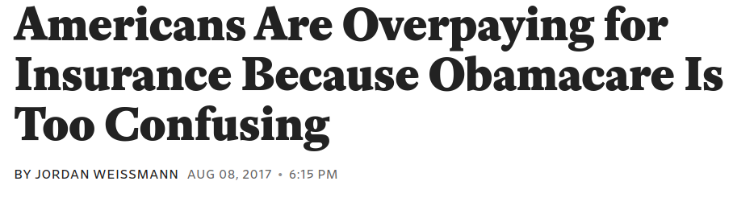
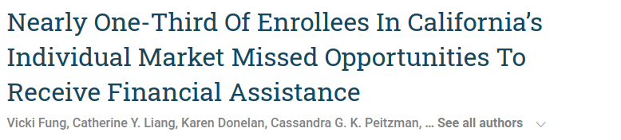
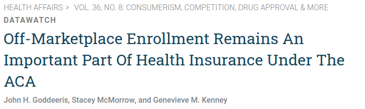
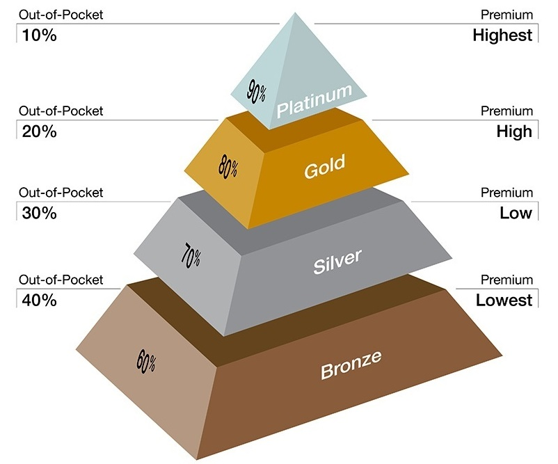
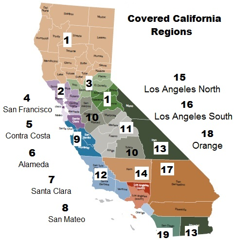

<!-- Adjust some CSS code for font size, maintain R code font size -->
<style type="text/css">
.remark-slide-content {
    font-size: 30px;
    padding: 1em 2em 1em 2em;    
}
.remark-code, .remark-inline-code { 
    font-size: 20px;
}
</style>


<!-- Set R options for how code chunks are displayed and load packages -->
```{r setup, include=FALSE}
options(htmltools.dir.version = FALSE)
options(dplyr.summarise.inform = FALSE)
library(knitr)
opts_chunk$set(
  fig.align="center",  
  fig.height=3, #fig.width=6,
  # out.width="748px", #out.length="520.75px",
  dpi=300, #fig.path='Figs/',
  cache=T#, echo=F, warning=F, message=F
  )

knitr::opts_hooks$set(fig.callout = function(options) {
  if(options$fig.callout) {
    options$echo = FALSE
  }
  options
})

if (!require("pacman")) install.packages("pacman")
pacman::p_load(tidyverse, ggplot2, dplyr, lubridate, readr, readxl, hrbrthemes,
               scales, gganimate, gapminder, gifski, png, tufte, plotly, OECD,
               ggrepel, xaringanExtra)
```


```{r xaringan-scribble, echo=FALSE}
xaringanExtra::use_scribble(rgb(0.9, 0.5, 0.5))
```

# Some decisions are hard

.center[
<iframe width="800" height="600" src="https://www.youtube.com/embed/oWXNf3JVWpI?start=146" frameborder="0" allowfullscreen></iframe>
]

---
# In the health insurance setting...

1. Insurance choice is confusing, particularly on the ACA exchanges

2. Size of the market introduces decision problems on a massive scale

---
# 1. Insurance choice is confusing

.center[
  
]
    
.footnote[
  [Slate, 2017](https://slate.com/business/2017/08/americans-are-overpaying-for-insurance-because-obamacare-is-confusing.html)
]
  
---
count: false

# 1. Insurance choice is confusing
.center[
  
]
    
.footnote[
  [Health Affairs, January, 2017](https://www.healthaffairs.org/doi/10.1377/hlthaff.2016.0472)
]


---
count: false

# 1. Insurance choice is confusing

.center[
  
]
    
.footnote[
  [Health Affairs, August, 2017](https://www.healthaffairs.org/doi/full/10.1377/hlthaff.2017.0085)
]

    
---
count: false

# 1. Insurance choice is confusing

  - "More than half of all uninsured (56%) say they are likely to go to the marketplace to find a health plan in the future. But there are knowledge gaps."
  - "Six in 10 are confused about or have not heard of the tax credit, and more than 7 in 10 want one-on-one help understanding their insurance options"


.footnote[
  [Robert Wood Johnson Foundation, **Understanding the Uninsured Now**, 2015](https://www.rwjf.org/en/library/research/2015/06/understanding-the-uninsured-now.html)
]

---
# 2. Potential scale

- 12.7 million enrollees on exchanges in 2016
- Down to 11.4 million in 2020
- Over 27 million remain uninsured

---
count: false

# 2. Potential scale

.pull-left[
Exchanges relatively large, but...

- Large number of people still uninsured
- Many eligible for some type of subsidy on exchanges
]

.pull-right[
  
]
    
    
    
.footnote[
  [Kaiser Family Foundation, November, 2020](https://www.kff.org/policy-watch/millions-of-uninsured-americans-are-eligible-for-free-aca-health-insurance/)
]


---
# This paper

Lots of people participating in a very complicated decision. With this in mind, we ask the following questions:

1. Does some form of decision assistance "help" in plan selection?
2. Does the type of assistance matter (private versus public)?
3. Do insurers use brokers/agents to steer people to different plans?
4. What are the welfare effects of any such steering?


---
# Outline of talk

1. [Background on the ACA](#background)
2. [Data](#data)
3. [Dominated choices](#dominated)
4. [Effects of decision assistance](#decision-assist)
5. [Insurer steering](#steering)


---
class: inverse, center, middle
name: background

# Background on the ACA exchanges

<html><div style='float:left'></div><hr color='#EB811B' size=1px width=1055px></html>


---
class: clear, center, middle


---
# What are the exchanges?

- Online marketplace to purchase private health insurance for those without insurance through their employers or other public programs

- Intended to help fill the "coverage gap" for the 40+ million uninsured individuals in the U.S. (pre ACA)

- Complicated program with various premium and cost-sharing subsidies, specific to a household

---
# Metal tiers

.pull-left[
To help with this complex decision, plans organized around tiers based on actuarial value
]

--

.pull.right[
  
]

---
# Rating areas

.pull-left[
Insurers limited in ability to adjust premiums

- Smoking
- Age
- Rating area
]

--

.pull-right[
  
]